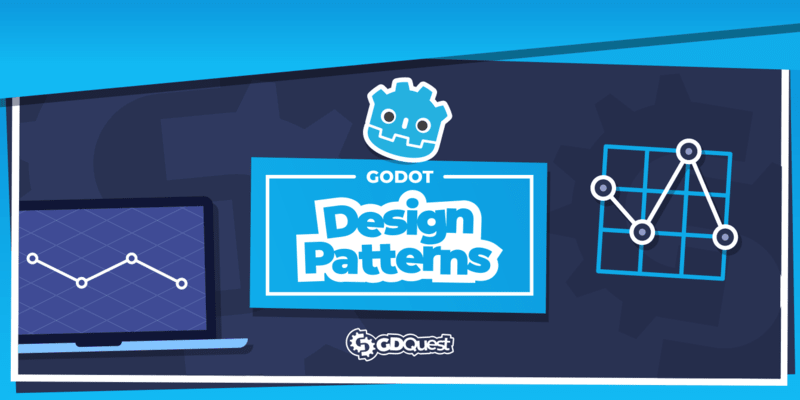

# Godot Design Patterns

Learn to implement design patterns in Godot using the GDScript programming language.

This repository is a collection of useful **programming patterns implemented in Godot**.

In this project, you will find our version of the Finite State Machine, an Entity-Component System, and more.

This project was funded and made possible by our course [Godot 2D secrets](https://gdquest.mavenseed.com/courses/godot-2d-secrets). If you would like to support us and get your game development skills to the next level, check our Godot courses.

Our courses and crowdfunding campaigns sponsor our [dozens of open-source Godot demos](https://github.com/GDQuest/) and free tutorials.

On our website, you will also find some free companion tutorials.

Here are the ones we released already:

- [Finite state machine in Godot](https://www.gdquest.com/tutorial/godot/design-patterns/finite-state-machine/)
